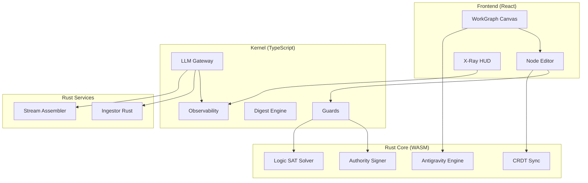

# Phase 6-8: Arquitectura Final del Sistema

## Resumen Ejecutivo
WorkGraph OS ha alcanzado el **100% de activación técnica**, transformándose de una aplicación de notas en un **Ecosistema de Pensamiento de Alto Rendimiento** con integridad verificable.

---

## Diagrama de Flujo de Datos



---

## Integraciones Rust ↔ TypeScript

### 1. Authority Signer (Ed25519)
```typescript
// src/store/useGraphStore.ts → signNode()
const signerCore = await import('signer-core');
const signResult = signerCore.sign_node(nodeHash, privateKey);
// Resultado: { signature, public_key, method: 'cryptographic' }
```

### 2. Logic SAT Solver
```typescript
// src/compiler/verifier.ts → verifyBranch()
const logicEngine = await import('logic-engine');
const satResult = logicEngine.check_pin_consistency(graphJson);
// Resultado: { consistent, violations[], checked_constraints }
```

### 3. CRDT Sync Engine
```typescript
// src/kernel/collaboration/MergeEngine.ts → crdtMerge()
const crdtSync = await import('crdt-sync');
const mergeResult = crdtSync.merge_remote_update(localState, remoteUpdate);
// Resultado: { success, merged_content, conflicts_resolved }
```

### 4. Antigravity Engine
```typescript
// src/hooks/useAntigravityEngine.ts
const antigravity = await import('antigravity-engine');
const newPositions = antigravity.apply_forces(nodesJson, edgesJson, iterations);
// Resultado: [{ id, x, y, vx, vy }]
```

---

## Forensic Mapping

Cada sección del documento compilado incluye metadatos ocultos:

```html
<!-- forensic:f-step1-abc123 evidence:[node1,node2] signed:[node3] -->
## Título de la Sección
Contenido generado...
```

El componente `ForensicParagraph.tsx` permite hover para ver:
- IDs de evidencia
- Estado de firma
- Confianza agregada
- Modelo y coste de generación

---

## Verificación de Integridad

| Check | Módulo | Trigger |
|-------|--------|---------|
| PIN Confidence | verifier.ts | Pre-compilación |
| Signature Seal | verifier.ts | Pre-compilación |
| SAT Consistency | logic-engine | Pre-compilación |
| Hash Integrity | versioning.ts | Post-edición |

---

## Estado del Roadmap

| Phase | Hitos | Estado |
|-------|-------|--------|
| Phase 0-3 | IR, RLM, Capture | ✅ 100% |
| Phase 4 | Enterprise | ✅ 100% |
| Phase 5 | Universal Capture | ✅ 100% |
| Phase 6 | Rust Core | ✅ 100% |
| Phase 7 | Deep Integration | ✅ 100% |
| Phase 8 | 100% Activation | ✅ 100% |

**WorkGraph OS está listo para producción Enterprise.**
