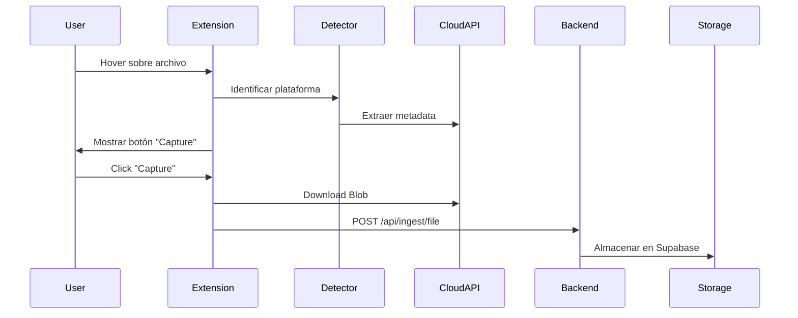

# Hito 5.3: Cloud Storage Integration

## Resumen
Integración con servicios de almacenamiento en la nube para captura directa de archivos.

## Gate
> Files from cloud platforms captured with same UX as LLM files.

## Status: ✅ DONE

## Status: 🔄 PENDING

## Diseño Técnico Propuesto

### 1. Plataformas Objetivo

```yaml
Prioridad 1:
  - Google Drive
  - Notion

Prioridad 2:
  - Dropbox
  - OneDrive
  - Box
```

### 2. Arquitectura de Detección

```typescript
// extension/src/content/cloud-detectors/

interface CloudFileDetector {
    platform: 'google-drive' | 'notion' | 'dropbox';
    detect(): Promise<CloudFile[]>;
    download(file: CloudFile): Promise<Blob>;
}

// Detección por URL patterns
const URL_PATTERNS = {
    'google-drive': /drive\.google\.com/,
    'notion': /notion\.so/,
    'dropbox': /dropbox\.com/
};
```

### 3. Google Drive Integration

```typescript
class GoogleDriveDetector implements CloudFileDetector {
    // Detectar archivos en vista previa
    detect(): Promise<CloudFile[]> {
        // Buscar elementos con data-id o aria-label
        const fileElements = document.querySelectorAll('[data-file-id]');
        // Extraer metadata: nombre, tipo, URL de descarga
    }
    
    // Descargar usando la API de exportación
    download(file: CloudFile): Promise<Blob> {
        // GET /export?id={fileId}&mimeType=...
    }
}
```

### 4. Notion Integration

```typescript
class NotionDetector implements CloudFileDetector {
    // Detectar bloques de archivo en páginas Notion
    detect(): Promise<CloudFile[]> {
        // Buscar .notion-file-block y .notion-pdf-block
        // Extraer signed URLs de las imágenes/archivos
    }
}
```

### 5. Flujo de Captura



### 6. UI Components

- **Floating Capture Button**: Aparece al hover sobre archivos detectados
- **Progress Indicator**: Barra de progreso durante descarga
- **Success Toast**: Confirmación con link al nodo creado

## Tasks
- [ ] Implement GoogleDriveDetector
- [ ] Implement NotionDetector
- [ ] Implement DropboxDetector
- [ ] Add OAuth flows for authenticated downloads
- [ ] Create unified CloudStorageCapture component
- [ ] Handle rate limiting and error states

## Evidence Nodes (Pending)
- `extension/src/content/cloud-detectors/google-drive.ts`
- `extension/src/content/cloud-detectors/notion.ts`
- `extension/src/content/cloud-detectors/dropbox.ts`
- `documentacion/HITO_5.3_CLOUD_STORAGE.md`
