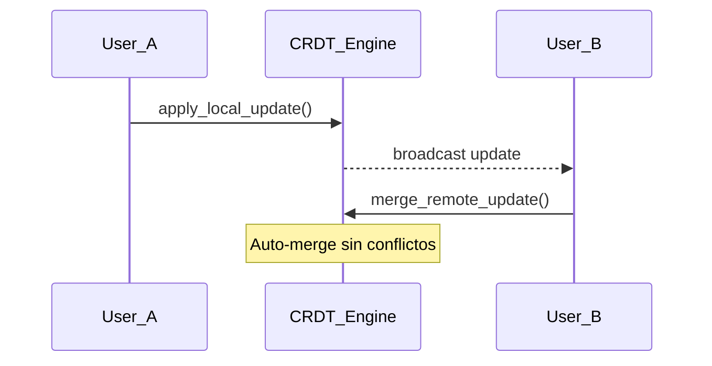

# Hito 6.3: CRDT Sync Engine

## Resumen
Motor de **Conflict-free Replicated Data Types** basado en **Yrs** (Yjs para Rust) que permite colaboración en tiempo real sin conflictos.

## Arquitectura

### crdt-sync/
- **Cargo.toml**: Dependencias `yrs`, `wasm-bindgen`, `base64`.
- **src/lib.rs**: Implementación del motor CRDT.

### Funciones Expuestas (WASM)

| Función | Descripción |
|---------|-------------|
| `create_document(content)` | Crea un documento CRDT con contenido inicial |
| `apply_local_update(state, content, pos)` | Aplica una edición local |
| `merge_remote_update(local, remote)` | Fusiona una actualización remota |
| `compute_diff(state_a, state_b)` | Calcula diferencias entre estados |

## Flujo de Colaboración



## Uso desde TypeScript

```typescript
import init, { create_document, merge_remote_update } from 'crdt-sync';

await init();

const localDoc = create_document("Contenido inicial");
const mergeResult = JSON.parse(merge_remote_update(localDoc, remoteUpdate));
console.log(mergeResult.merged_content);
```

## Gate de Verificación
✅ Ediciones concurrentes se fusionan correctamente sin conflictos.

## Evidencia
- `crdt-sync/src/lib.rs`
- `src/types/crdt-sync.d.ts`
