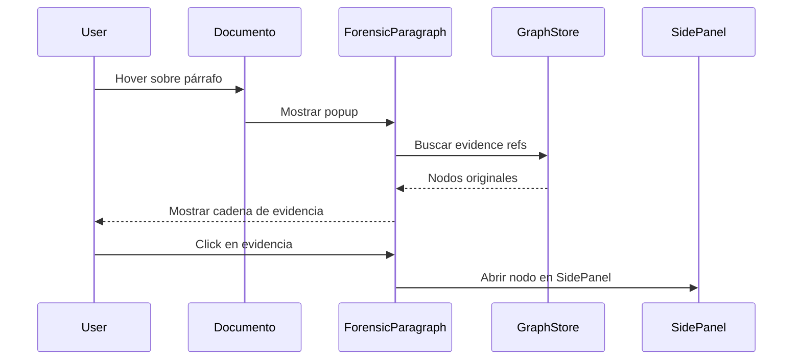

# Hito 7: Deep Forensic Mapping

## Resumen
Sistema de **trazabilidad a nivel de párrafo** que conecta cada frase del documento generado con sus nodos de evidencia y firmas humanas originales.

## Arquitectura

### Inyección de IDs Forenses
El `assembler.ts` inyecta metadatos ocultos en cada sección:

```html
<!-- forensic:f-step1-abc123 evidence:[node1,node2] signed:[node3] -->
## Título de la Sección
Contenido generado...
```

### Componente ForensicParagraph
Ubicación: `src/components/ui/ForensicParagraph.tsx`

**Props:**
- `content`: Texto del párrafo
- `forensicData`: Metadatos con IDs de evidencia y firmas
- `onEvidenceClick`: Callback para navegar al nodo original

**Funcionalidad:**
- Hover muestra popup con cadena de evidencia
- Barra de confianza visual (verde/amarillo)
- Indicador de firma humana (escudo ámbar)
- Click navega al nodo original

## Flujo de Datos



## Gate de Verificación
✅ Al pasar el ratón por cualquier párrafo, se muestra la evidencia exacta que lo respalda.

## Evidencia
- `src/components/ui/ForensicParagraph.tsx`
- `src/compiler/assembler.ts` (forensic ID injection)
