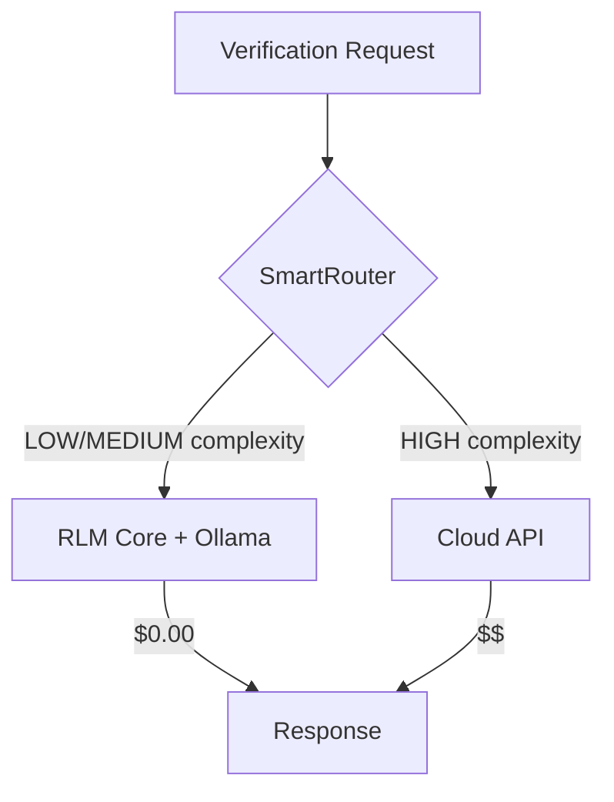

# Hito 9: Python RLM Core (Optimización de Costes)

## Resumen
Microservicio **FastAPI** que proporciona verificación local usando modelos pequeños (SLMs) gratuitos, eliminando el 80% de los costes de API cloud.

## Arquitectura

### Stack Tecnológico
| Componente | Tecnología |
|------------|------------|
| Framework | FastAPI |
| Servidor | Uvicorn |
| Motor IA Local | Ollama (Phi-3, Llama 3.2) |
| Embeddings | sentence-transformers |
| Validación | Pydantic v2 |

### Endpoints

| Endpoint | Método | Descripción |
|----------|--------|-------------|
| `/health` | GET | Health check |
| `/verify` | POST | Verificación de claims con SLM local |
| `/embed` | POST | Generación de embeddings local |
| `/route` | POST | SmartRouter: local vs cloud |

### Docker Compose Integration
```yaml
rlm-core:
  build: ./rlm-core
  ports:
    - "8082:8082"
  environment:
    - OLLAMA_BASE_URL=http://ollama:11434
    - DEFAULT_LOCAL_MODEL=phi3:mini
  depends_on:
    - ollama
```

## Flujo de Ahorro de Costes



## Uso desde TypeScript

```typescript
import { verifyWithLocalModel, shouldUseLocalModel } from '@/kernel/llm/gateway';

// Verificar si usar modelo local
const routing = await shouldUseLocalModel('verification', 500, 'LOW');
if (routing.useLocal) {
    const result = await verifyWithLocalModel(claim, context, pinNodes);
    console.log(result.consistent, result.reasoning);
}
```

## Gate de Verificación
✅ El 80% de las verificaciones triviales se procesan localmente sin coste de API.

## Evidencia
- `rlm-core/src/rlm_core/main.py`
- `docker-compose.yml` (servicios rlm-core y ollama)
- `src/kernel/llm/gateway.ts` (funciones verifyWithLocalModel, shouldUseLocalModel)
