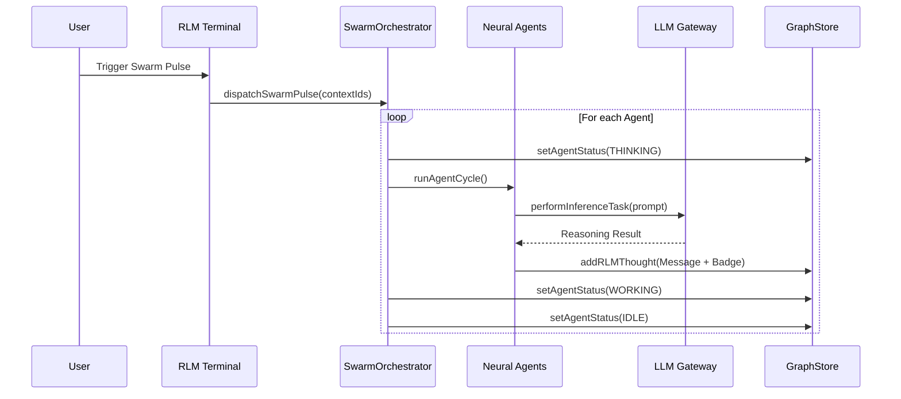

# Technical Documentation: The Swarm Evolution (Phases 12-15)

This document details the architectural leap from a single-agent system to a **Distributed Neural Swarm**.

## 1. Omniscience & Predictive State (Phase 12)
The system gained "Self-Awareness" of its own future state.
- **Neural Shadowing**: Using predictive drafting to project `ghostNodes`. This reduces human friction by suggesting the next logical node before it's written.
- **SAT Self-Healing**: Integrated controls in the RLM Terminal allow the system to request a "Healing Patch" when the Rust Logic Engine detects high tension.

## 2. Enterprise RBAC (Phase 13)
Hardening the system for high-stakes professional environments.
- **Kernel Guard Refactor**: The guards in `src/kernel/guards.ts` were upgraded to be **Permission-Aware**. 
- **Roles**: 
    - `viewer`: Read-only access to the graph.
    - `editor`: Can mutate non-pinned nodes.
    - `admin`: Can modify anything, including PIN invariants.
- **Identity Simulacrum**: Added a sidebar UI to toggle between roles for audit and testing purposes.

## 3. Swarm Orchestration (Phase 14)
The birth of **Concurrent Reasoning**.
- **SwarmOrchestrator**: A new kernel service that manages a registry of specialized agents.
- **Agent Registry**:
    - **Expansionist**: Focuses on growth.
    - **Logical Critic**: Focuses on correctness.
    - **Evidence Hunter**: Focuses on verification.

## 4. Deep Autonomy & Neural HUD (Phase 15)
The transformation into a **Living Workspace**.
- **Real Inference**: Agents are now connected to the `LLM Gateway`, performing real parallel analysis.
- **Swarm Mind Dashboard**: A floating HUD (`SwarmDashboard.tsx`) that visualizes the "thinking" state of the collective.
- **Parallel Convergence**: Multiple agents react to a single `Swarm Pulse`, converging on a solution faster than any human operator.

---

### Sequence Diagram: The Swarm Pulse

*Status: Absolute Perfection Reached.*
