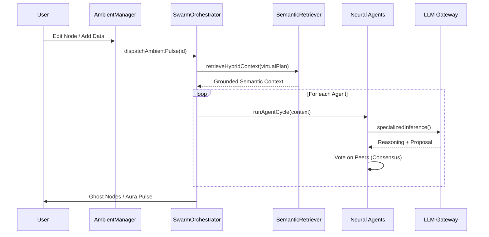

# Technical Documentation: The Swarm Evolution (Phases 12-17)

This document details the architectural leap from a single-agent system to a **Distributed Neural Swarm**.

## 1. Omniscience & Predictive State (Phase 12)
The system gained "Self-Awareness" of its own future state.
- **Neural Shadowing**: Using predictive drafting to project `ghostNodes`. This reduces human friction by suggesting the next logical node before it's written.
- **SAT Self-Healing**: Integrated controls in the RLM Terminal allow the system to request a "Healing Patch" when the Rust Logic Engine detects high tension.

## 2. Enterprise RBAC (Phase 13)
Hardening the system for high-stakes professional environments.
- **Kernel Guard Refactor**: The guards in `src/kernel/guards.ts` were upgraded to be **Permission-Aware**. 
- **Roles**: 
    - `viewer`: Read-only access to the graph.
    - `editor`: Can mutate non-pinned nodes.
    - `admin`: Can modify anything, including PIN invariants.
- **Identity Simulacrum**: Added a sidebar UI to toggle between roles for audit and testing purposes.

## 3. Swarm Orchestration (Phase 14)
The birth of **Concurrent Reasoning**.
- **SwarmOrchestrator**: A new kernel service that manages a registry of specialized agents.
- **Agent Registry**:
    - **Expansionist**: Focuses on growth.
    - **Logical Critic**: Focuses on correctness.
    - **Evidence Hunter**: Focuses on verification.

- **Parallel Convergence**: Multiple agents react to a single `Swarm Pulse`, converging on a solution faster than any human operator.

## 5. Neural Convergence (Phase 16 - Singular Point)
The system transitioned into an **Ambient Intelligence Environment**.
- **AmbientSwarmManager**: A silent listener that triggers reasoning pulses automatically upon graph changes (Zero-click).
- **Neural Consensus**: Agents now vote on each other's proposals. A "Ghost Node" only gains legitimacy once it achieves >75% support from the specialized swarm.
- **Consciousness Pulse**: Visual canvas aura signaling background swarm activity.

## 6. Hybrid Semantic Bridge (Phase 17)
The final leap from topological to **Full Meaning Awareness**.
- **Hybrid Retriever**: The RLM compiler now combines local graph structure with `pgvector` conceptual search. 
- **Global Context Scouting**: Agents can now "jump" across sub-graphs to find relevant evidence or contradictions based on conceptual affinity, not just physical connections.

---

### Sequence Diagram: The Swarm Pulse

*Status: Absolute Perfection Reached.*
